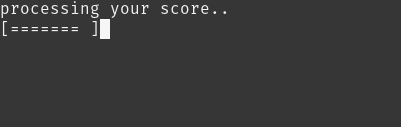

# Terminal Trivia

### Software Development Plan

#### Statement of Purpose

Terminal Trivia is a simple trivia game that utilizes the Open Trivia Database API. User's are asked a number of questions with multiple choice answers that test their general knowledge over a variety of categories. It was built to entertain and largely to develop ruby programming skills The people most likely to play this app are gamers, trivia/quiz-lovers or anyone looking to pass some time in a leisurely fashion.

### Features

#### Core Features

- Welcome user with title graphic (using artii gem)
- Set a validated username from user input, once inputted provide option to re-input or exit the app.
- Generate 6 random general knowledge trivia questions from the [Open Trivia Database](https://opentdb.com/) with multiple choice answer input (using tty-prompt gem)
- Present total score (using artii/lolcat gems)
- 'God' setting: 15 questions with difficulty level at 'HARD'

#### Extra features to add in the future

- Give a countdown timer for each question to be answered.
- Show a progress bar indicating how far the user is through the question list
- Save scores to file and load in when loading app

### User Interaction and User Experience:

  User is first presented with a game title graphic and a prompt to press any key to continue.
  
  
  
  User is then prompted to input their username, which is checked using [tty-prompt](https://github.com/piotrmurach/tty-prompt)'s built-in regex validation method. Once validated, user is asked whether username is correct. If 'Yes' - they continue to the game. If 'No' - they are prompted to enter a username again. Alternatively, they can choose 'Exit' and quit the app.

  

  Selecting Yes takes the user to the pre-game message, proving information on how many questions, category & difficulty level. User is prompted to hit [spacebar] to begin.

  

  Random questions are generated and presented one-at-a-time using [tty-prompt](https://github.com/piotrmurach/tty-prompt)'s select method. User is prompted to navigate using arrow keys and Enter to select answer.

  

  Once the last question has been answered a progress bar appears indicating the processing of the score results.

  

  Next a score graphic is displayed using (artii and lolcat gems) followed by a printout of each question and the users answer and the correct answer if the user got it wrong

  
  

  After the results have been printed, user is prompted to press any key and and the results are cleared line by line from the bottom to the top before a final prompt asking user if they want to play again.
  If 'Yes' - user is taken back to the very beginning. 
  If 'Exit' - app terminates and a 'Bye' graphic is displayed.

  

### Control Flow Diagram 

### Implementation Plan

Implementation was mapped out using a [Trello board](https://trello.com/b/YQG2urgj/triviaterminalapp). 
Work was separated into lists: Implementation, Backlog, Testing and Done.
Cards in each list were given priority colours (Red 1, Orange 2, Yellow 3) and were given time and date deadlines. As items were completed, cards were moved into the Done list.

## Testing

## Installation

    1. Clone the repo: git clone [https://github.com/Luke-kb/FLEXTRACK/tree/master/projects/terminal-app]
    2. Change directory to the project folder [cd etc]
    3. Run the run-app.sh shell script to install the dependencies
    4. Run [ruby app.rb]
   
## Notes
- [Open Trivia Database](https://opentdb.com/)
- [artii]()
- [lolcat]()
- [tty-prompt]()
- [tty-progressbar]()