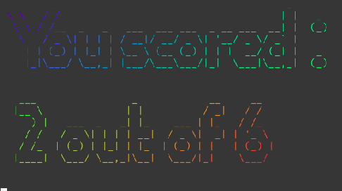
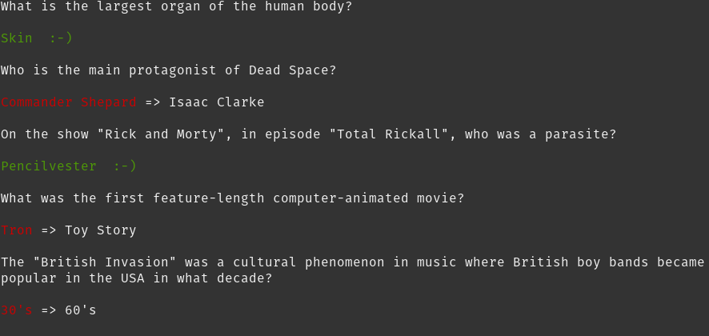
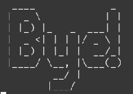
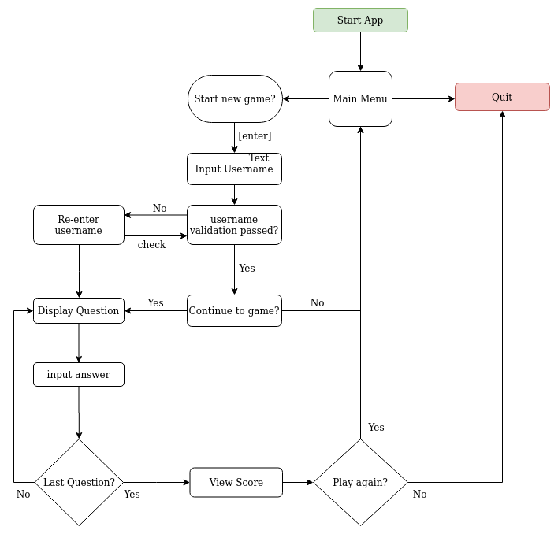
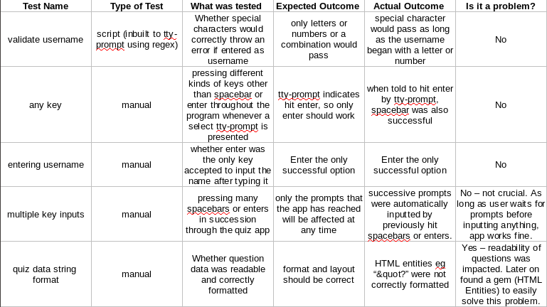

# Terminal Trivia
- [Link to repo](https://github.com/Luke-kb/FLEXTRACK)
### Software Development Plan

#### Statement of Purpose

Terminal Trivia is a simple trivia game that utilizes the Open Trivia Database API. User's are asked a number of questions with multiple choice answers that test their general knowledge over a variety of categories. Score and results will be printed and disappear line by line before giving the user the option to play again or exit. It was built to entertain and largely to develop ruby programming skills The people most likely to play this app are gamers, trivia/quiz-lovers or anyone looking to pass some time in a leisurely fashion.

Terminal Trivia can be run using the `run-app.sh` file located in the `src` folder. 
For detailed installation instructions see the Installation section of this README or the help file.

### Features

#### Core Features

##### Set a validated username
  Username is set by user, using a built-in prompt and validation method of tty-prompt. Once username is validated, user confirms it is correct and then proceed to the game or exit the app.
  
##### Generate trivia questions 
  Six Random general knowledge trivia questions from the [Open Trivia Database](https://opentdb.com/) are pulled using the provided API (and with help from HTTParty). tty-prompt provides simple question and answer navigation and multiple choice answer input. Default API call request 6 general knowledge questions in the 'EASY' difficulty level. This info is presented to the user just prior to answering the first question.
  
##### Print Score and Results
  Once all question been answers, score is printed first in big rainbow graphic (using artii and lolcat gems). Score is calculated as each answer is given and pushed into an array to be printed out in the form of score results. Assisted by HTMLEntities gem to decode the html entities present in the data (eg, &quot? etc.) A bit of font colouring (using colorize gem) was used to make it more readable and fun.
  
  #####  GOD setting
  Using the built in ARGVs in ruby (aka command line variables) the user can initiate GOD mode: 15 general knowledge multiple choice questions with difficulty level set at 'HARD'. To do so, en run app from command line and include the `-g` flag: `ruby app.rb -g`

#### Extra features to add in the future

- Give a countdown timer for each question to be answered. User would have a limited amount of time (say 5-10 seconds) to answer the question, otherwise the highlighted response is inputted.
- Show a progress bar indicating how far the user is through the question list. Ideally below the question prompt.
- Save scores to file on the users machine and load in when app starts. This way previous scores can be saved and added to a high score list.

### User Interaction and User Experience:

  User is first presented with a game title graphic and a prompt to press any key to continue.
  
  
  
  User is then prompted to input their username, which is checked using [tty-prompt](https://github.com/piotrmurach/tty-prompt)'s built-in regex validation method. Once validated, user is asked whether username is correct. If 'Yes' - they continue to the game. If 'No' - they are prompted to enter a username again. Alternatively, they can choose 'Exit' and quit the app.

  

  Selecting Yes takes the user to the pre-game message, providing how many questions, category & difficulty level. User is prompted to hit [spacebar] to begin.

  

  Random questions are generated and presented one-at-a-time using [tty-prompt](https://github.com/piotrmurach/tty-prompt)'s select method. User is prompted to navigate using arrow keys and Enter to select answer.

  

  Once the last question has been answered a progress bar appears indicating the processing of the score results.

  

  Next a score graphic is displayed using (artii and lolcat gems) followed by a printout of each question and the users answer and the correct answer if the user got it wrong (using colorize gem help indicate this).

  
  

  After the results have been printed, user is prompted to press any key and and the results are cleared line by line from the bottom to the top (using tty-cursor) before a final prompt asking user if they want to play again.
  If 'Yes' - user is taken back to the very beginning. 
  If 'Exit' - app terminates and a 'Bye' graphic is displayed.

  

### Control Flow Diagram 

### Implementation Plan

Implementation was mapped out using a [Trello board](https://trello.com/b/YQG2urgj/triviaterminalapp). 
Work was separated into lists: Implementation, Backlog, Testing and Done.
Cards in each list were given priority colours (Red 1, Orange 2, Yellow 3) and were given time and date deadlines. As items were completed, cards were moved into the Done list.

### Testing

### Installation

Please see Help.md
   
#### Links
- [Open Trivia Database](https://opentdb.com/)
- [artii](https://github.com/miketierney/artii)
- [lolcat](https://github.com/busyloop/lolcat)
- [tty-prompt](https://github.com/piotrmurach/tty-prompt)
- [tty-progressbar](https://github.com/piotrmurach/tty-progressbar)
- [tty-cursor](https://github.com/piotrmurach/tty-cursor)
- [colorize](https://github.com/fazibear/colorize)
- [HTTParty](https://github.com/jnunemaker/httparty)
- [HTMLEntities](https://github.com/threedaymonk/htmlentities)